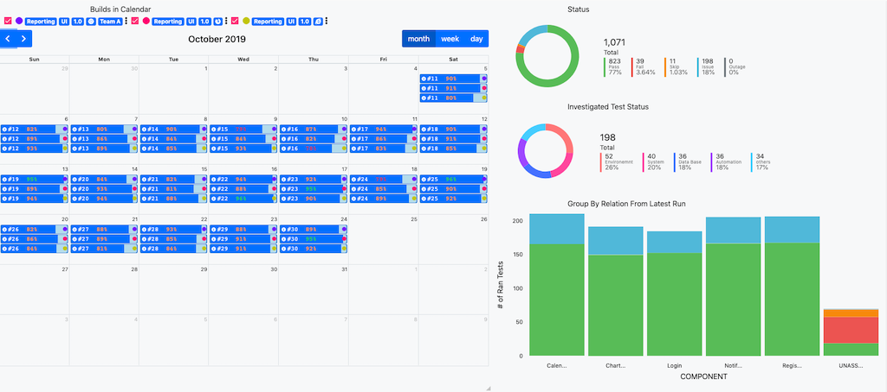
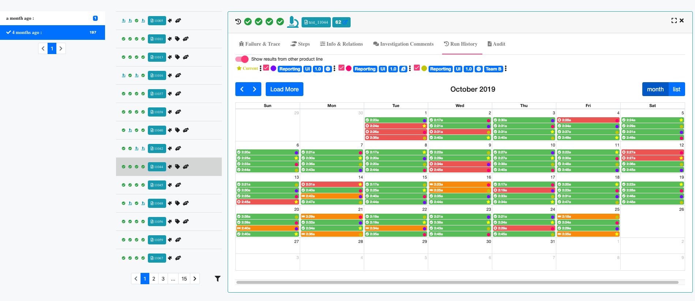

# UReport Server
### Server side reporting and analyzing software for local develop or CI automation execution
[Demo](https://ureport-demo.herokuapp.com/#/)
Username/password: operator/password

If you need to admin permission, please contact ureport@outlook.com

# Prerequiste
- MongoDB
- Nodejs

# How to install
1. Download or clone the repo.
2. Open a terminal
3. cd to the loaction of the repo
4. Run `npm install`
5. Go to config folder, change DBHost and PORT if it is different from the given one
    + If you need to deploy is as prod, please modify the file **production.json**
6. Runb `npm install --global coffeescript`
6. Run `coffee initalization.coffee ` to initilize db
7. Run `npm start` to start the server
8. Open browser and go to http://localhost:4100 to start using the application
    + By default, there is one admin user created for you with credential admin/1234. You can change it in the app or use API to add addtional user.
# Overview

# Features

<h2 class="display-5"><i class="fas fa-microscope"> Auto Analysis</i></h2>

Never do the same work twice!

Start your day with all of your repeated failures already analyzed.

UReport allows you to save big on time and effort by auto analyzing and retagging the failures that were studied and tagged in a previous run.

<h2 class="display-5"> <i class="fa fa-wrench"> Customize Dashboard</i></h2>

No need to search hard for the info you need!

Our customizable dashboard allows you to get the stats you want as soon as you open UReport!
You can use our user friendly module to create your own bar charts, line charts and tables to see the pass rates, fail rates, percentage of skipped tests and analyzed tests.

<h2 class="display-5"> <i class="fas fa-balance-scale"> Compare different product</i></h2>

When you need to compare the results of different runs or even different products, you can use one of UReport’s modules to either create a table or a chart to compare stats.

You can also simply split the screen in 2 and compare the results side by side! 

<!-- # What to contribute to UI?
Check out our UI repo -->