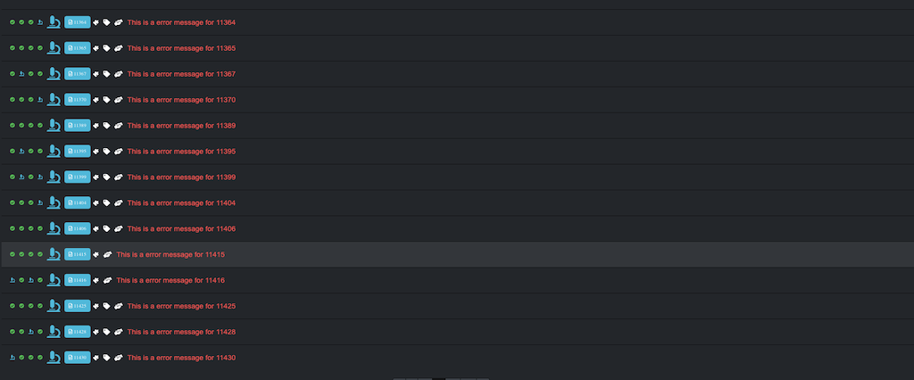
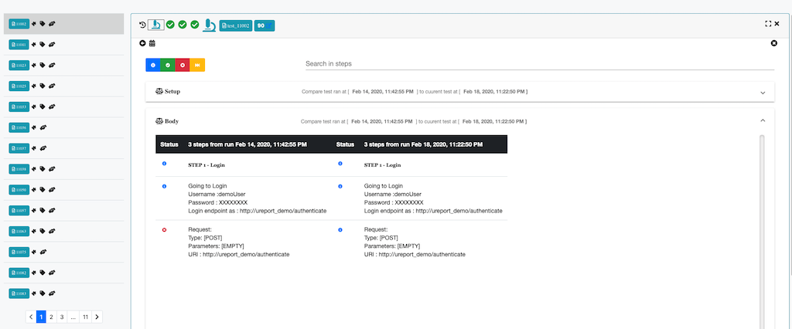
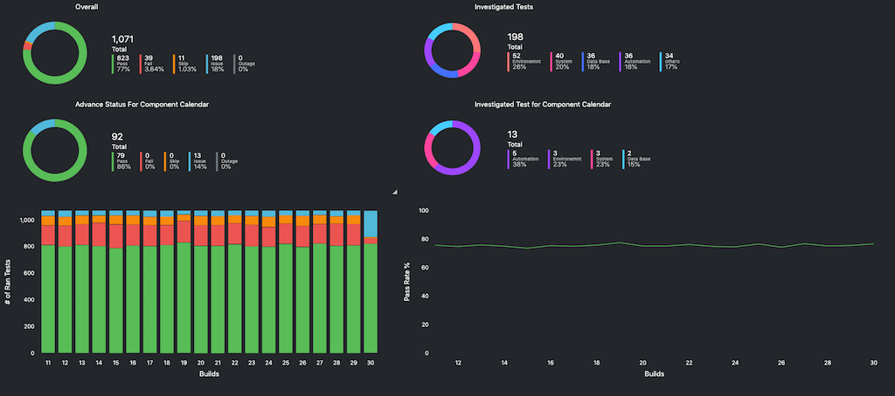
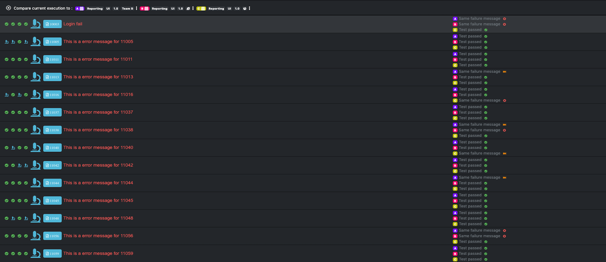

# UReport
### Stand-alone server-side reporting and analyzing software for local or CI automation.
[Demo](https://ureport-demo.herokuapp.com/#/)

If you want to explorer more features in an admin model, please contact ureport@outlook.com
or
Download and set up your own environment.

# Prerequiste
- MongoDB (> 3.0)
- Nodejs (> 12.0)
    - [Nodejs site](https://ureport-demo.herokuapp.com/#/)

# How to install
1. Download or clone the repo.
2. Open a command-line terminal
3. cd to the location of the folder
4. Run `npm install`
5. Go to config folder, change DBHost and PORT if it is different from the given one
    + If you need to deploy it as prod, please modify the file **production.json**
6. Run `npm install --global coffee-script`
7. Run `coffee initialization.dev.coffee ` to initialize the dev database 
    + the script will create an admin user, system setting, and dashboard templates
8. Run `npm start` to start the server
9. Open the browser and go to http://localhost:4100 to start using the application
    + By default, there is one admin user created for you with credential admin/1234. You can change it in the app or use API to add more user.

# Overview
This repo includes everything you need to set up your UReport server. And it is production-ready to be used once you have downloaded it. You have access to all the backend server code as well.

# Features
<h4 class="display-5"><i class="fas fa-microscope"> Auto Analysis</i></h2>

Never do the same work twice!

Start your day with all of your repeated failures already analyzed.

UReport allows you to save big on time and effort by auto analyzing and retagging the failures that were studied and tagged in a previous run.

<h4 class="display-5"> <i class="fa fa-wrench"> Customize Dashboard</i></h2>

No need to search hard for the info you need!

Our customizable dashboard allows you to get the stats you want as soon as you open UReport!
You can use our user friendly module to create your own bar charts, line charts and tables to see the pass rates, fail rates, percentage of skipped tests and analyzed tests.

<h4 class="display-5"> <i class="fas fa-balance-scale"> Compare different product</i></h2>

When you need to compare the results of different runs or even different products, you can use one of UReport’s modules to either create a table or a chart to compare stats.

You can also simply split the screen in 2 and compare the results side by side! 

# How to send test data to UReport
UReport offers various API for you to adjust your automation framework to send data.
There are two important collections you need to know about for you to send your data.
 
**Build and Test**

Build is a collection that holds all your executions. It is named Build to reflect the build number your CI software generated when building your application and executing automation tests
  
Test is a collection that holds all your tests that belongs to a specific build
 
Once you deploy the server, you can go to http://your-server:your-port/api-docs/
Or
You can log in with user admin and go to http://your-server:your-port/#/faq
This page contains basic information about how UReport works
<!-- # What to contribute to UI?
Check out our UI repo -->