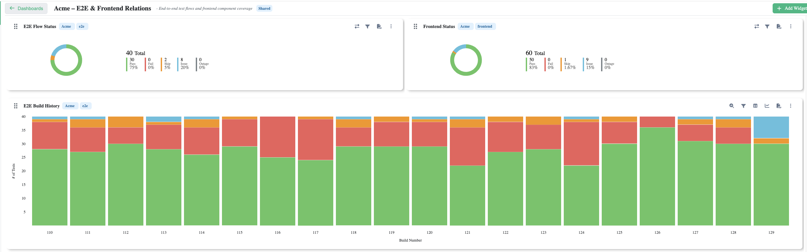
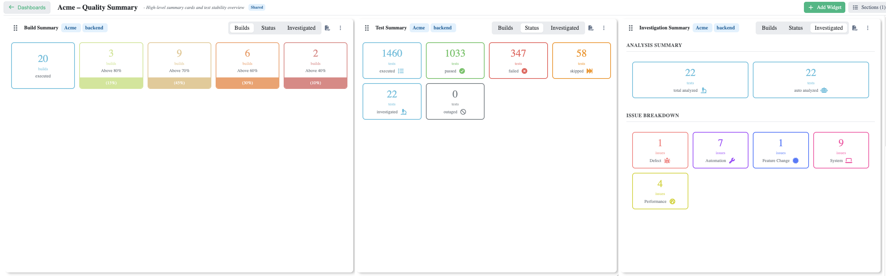
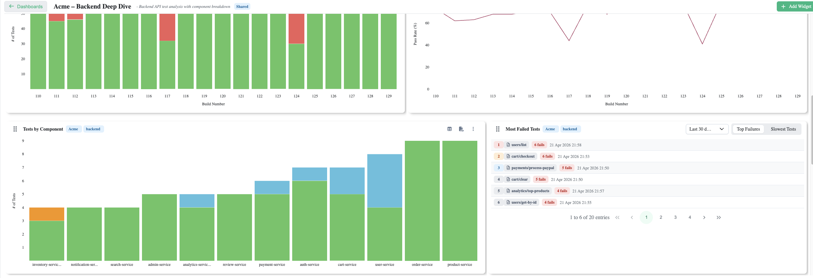
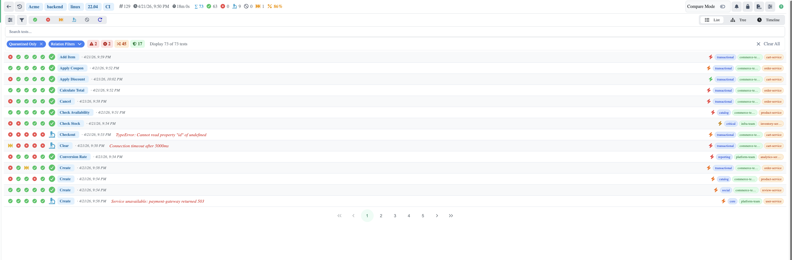
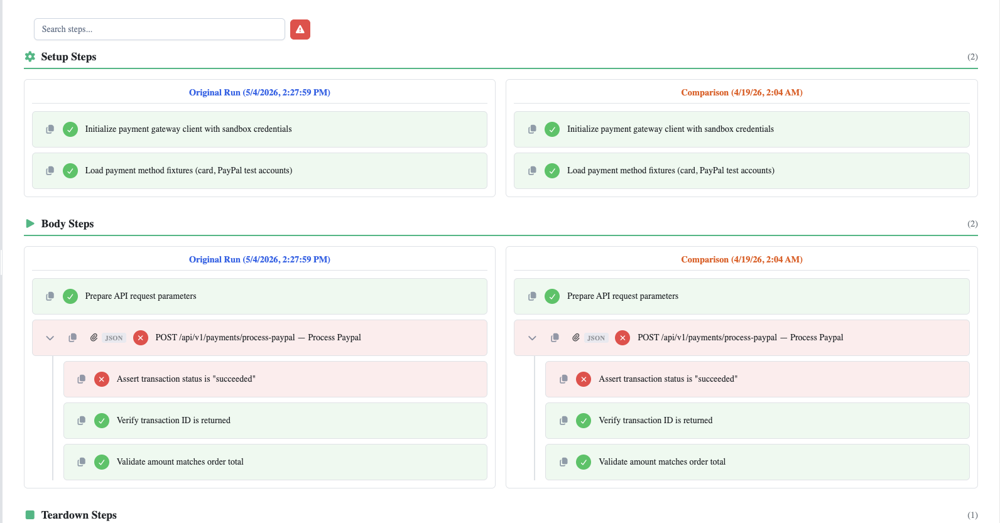
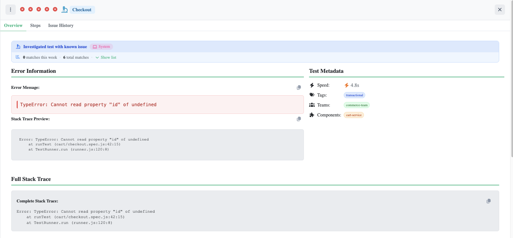
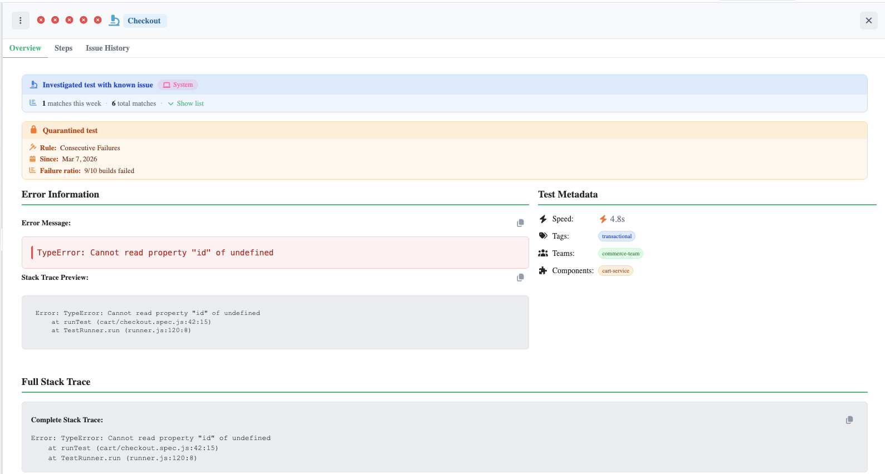
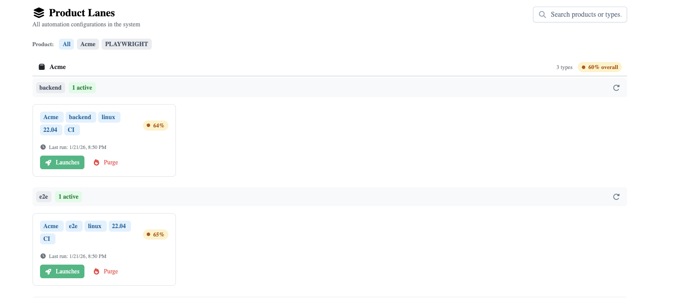

# UReport

Stand-alone server-side reporting and analysis software for local or CI automation.

## Features

### Dashboard Builder

Drag-and-drop grid layout with configurable widgets: pass rate line charts, pie charts, bar charts, treemaps, heatmaps, summary cards, and analysis tables.





---

### Test Results Explorer

Browse test results in four switchable views: tree (class/suite hierarchy), list, build comparison (side-by-side A/B/C coloring), and timeline (slider-based time range filter).




---

### Auto-Analysis

Repeated failures are automatically matched and re-tagged based on previous investigations.



---

### Quarantine System

Flag flaky tests to suppress noise; quarantine entries auto-expire after 90 days.



---

### Product Lane Overview

Top-level view of all test execution lanes grouped by product, showing live pass rates and health status.



---

### Also included

- Test Relations & Investigated Test table
- Public Dashboard Sharing
- Role-based access (admin / operator / viewer)
- User management with admin approval workflow
- Email notifications (build completion, test assignments)
- API token authentication
- Audit logging
- Swagger API docs at `/api-docs`

## Prerequisites

- Node.js ≥ 18.x
- MongoDB ≥ 3.0

## Quick Start

1. Clone the repo.
2. Run `npm install`.
3. Edit `config/dev.json` — set `DBHost` and `PORT` if the defaults don't fit your environment.
4. Run `npm run initialize` to seed the database (creates the admin user, system settings, and dashboard templates).
5. Run `npm start`.
6. Open `http://localhost:4100` in your browser.

Default credentials: **admin / 1234**

## Configuration

| Key        | Description                                        | Default                       |
| ---------- | -------------------------------------------------- | ----------------------------- |
| `DBHost`   | MongoDB connection string                          | `mongodb://localhost/ureport` |
| `PORT`     | HTTP port the server listens on                    | `4100`                        |
| `NODE_ENV` | Runtime environment (`development` / `production`) | `development`                 |

**Development:** edit `config/dev.json`.

**Production:** set `NODE_ENV=production` and supply `DBHost` as an environment variable (or edit `config/production.json`). In production the server runs as a cluster (2–4 workers).

## Sending Test Data

UReport stores test results in two collections:

- **Build** — represents a single execution (e.g. a CI build). Holds metadata like build number, product, and environment.
- **Test** — represents an individual test case that belongs to a Build.

**Official reporters:**

- [ureport-playwright-reporter](https://www.npmjs.com/package/ureport-playwright-reporter) — Playwright
- [ureport-jest-reporter](https://www.npmjs.com/package/ureport-jest-reporter) — Jest
- [ureport-pytest-reporter](https://pypi.org/project/ureport-pytest-reporter/) — pytest

Or POST directly to the REST API — see the interactive reference at `http://your-server:port/api-docs`.

## API Documentation

Once the server is running, the full Swagger UI is available at:

```
http://your-server:your-port/api-docs
```

Most endpoints require either a session cookie (browser login) or an `Authorization: Bearer <token>` header (API token).

## npm Scripts

| Script               | Description                                                          |
| -------------------- | -------------------------------------------------------------------- |
| `npm start`          | Start the server                                                     |
| `npm run initialize` | Seed the database (admin user, system settings, dashboard templates) |
| `npm run seed`       | Generate sample data                                                 |
| `npm test`           | Run the test suite                                                   |
